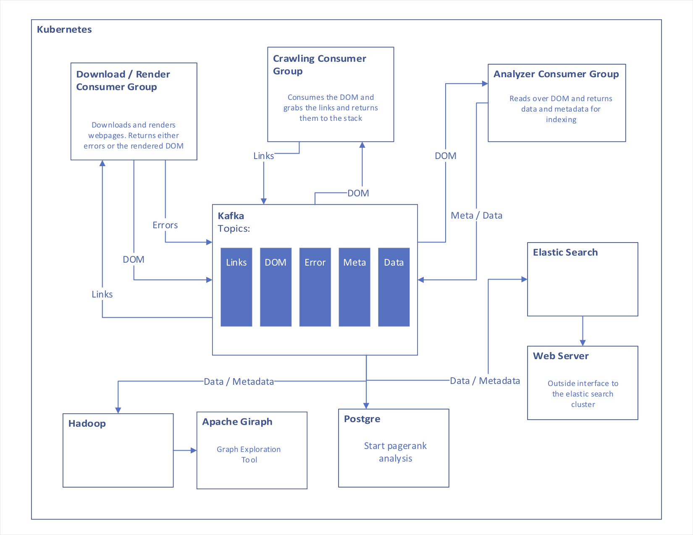

# Yet Another Search Site

This projet while contianing no code will act as the core for exploring the way to create a scaleable Search Engine similar to the ones that are in use by the major search engine sites. 

## Architecture 

Here is an overview of the architecture used. This is by no means all that is involved in modern search engines however will work as a base from which to learn and grow. 

Kafka is used as the core for this system, because it can support the scale needed for this project. The way this works is nodes that have the same functionality are assigned a consumer group. Any time one of the consumers reaches out for the next link for example Kafka will produce the next link that has not been consumed by that consumer group. In this way multiple consumer groups can query the same data and be operating at their own speed over the data. 

Kafka operates similar to TCP in the sense that it has measures in place to ensure that the consumer was able to process the data. If a consumer was to die mid-process it could provide that link to the next consumer. 

Kubernetes controls the node creation. It ensures that each consumer group has the alloted number of nodes. If nodes die off then Kubernetes will reinstate them. Also, if containers need to be added it is as simple as modifying a config file. 

#### Download / Render 

This process will be managed by a service that interacts with [htmlspitter](https://github.com/qdm12/htmlspitter). This service will read urls from the Kafka Links topic and will download and render the pages. The rendered DOM will then be put onto the DOM stack. If there are errors we will put them on the error topic to retry at another date potentially

#### Crawler 

Here we are going to grab all of the url's off of a page. Once we have the links off of a page we will go ahead and make an attempt to place them on the Link topic. The link topic will not allow duplicates.

While this may seem like a simple task part of the problem that will be had with this is that many new and modern websites are completely controlled through Javascript. This can make traversing them difficult if not impossible. Also, many websites use linking to direct you to different parts of the same page. 

#### Analyzer 

The analyzers will extract metadata from the DOM and use the DOM to generate data that will be usefull for indexing the page. 

